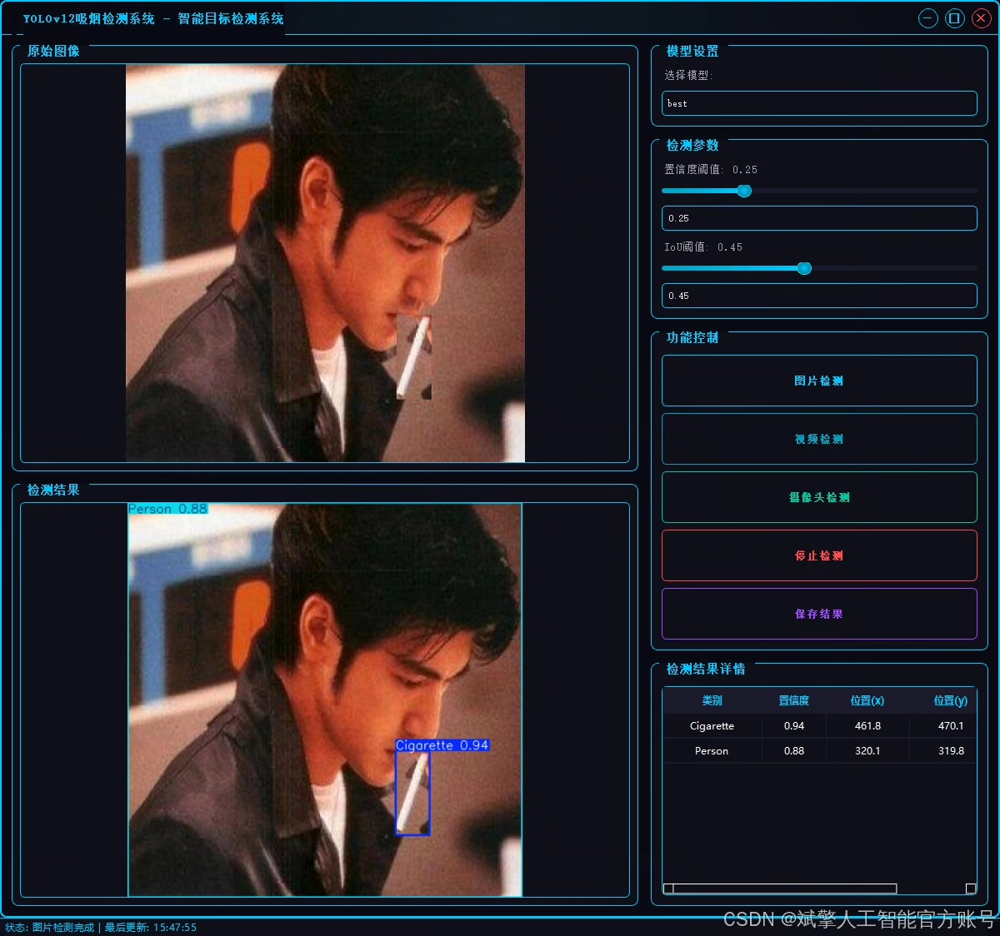
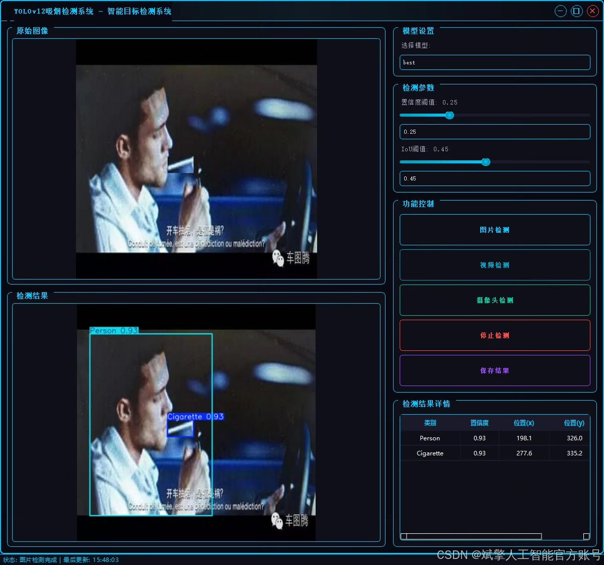
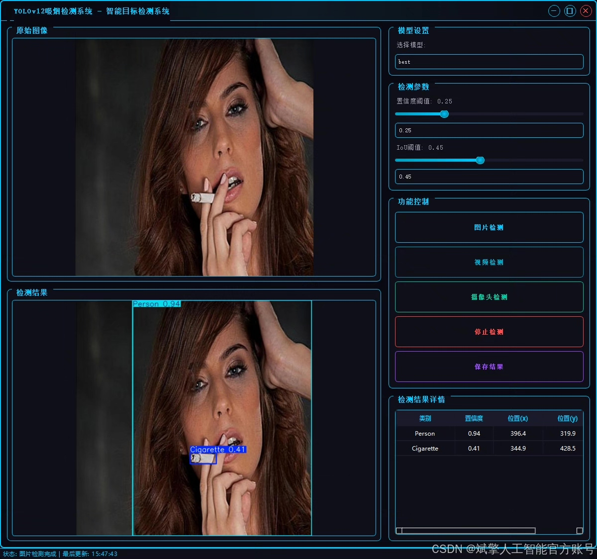
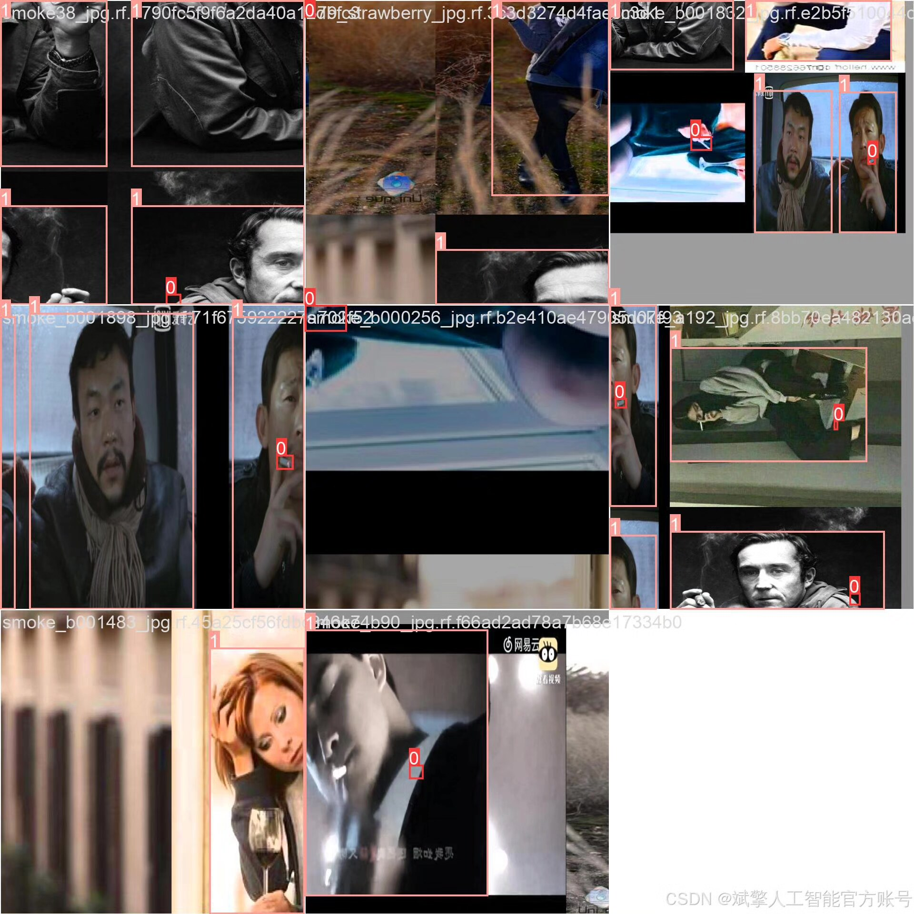
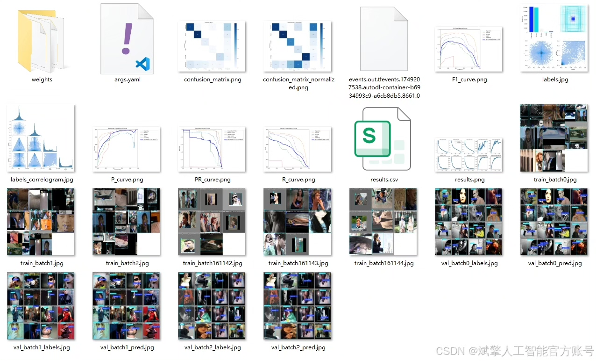
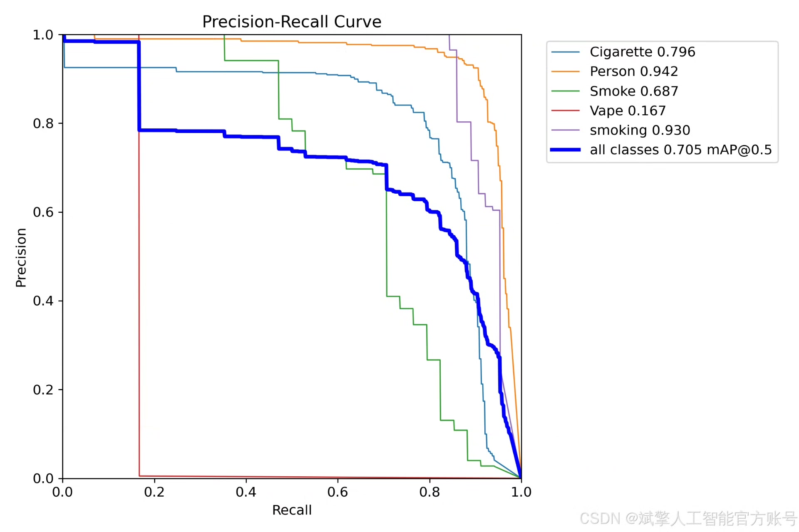
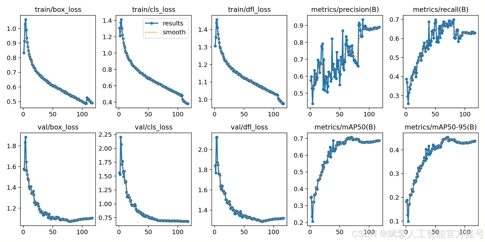
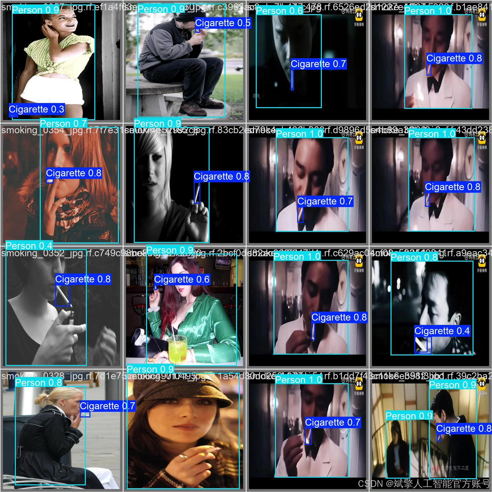

# YOLOv12 Smoking Behavior Detection System

## Body

This paper introduces a high-precision smoking behavior detection system based on the advanced object detection algorithm YOLOv12. The system aims to identify and locate various smoking-related targets in real-time, including cigarettes (Cigarette), people (Person), smoke (Smoke), e-cigarettes (Vape), and overall smoking behavior (smoking). By precisely detecting these fine-grained targets, the system can effectively determine whether there is smoking behavior in the scene and further analyze the specific details of the behavior (such as using traditional cigarettes or e-cigarettes). The system was trained and validated on a large-scale, high-quality dataset containing more than 12,000 labeled images, covering various complex scenarios. Experimental results show that the system has high accuracy, robustness, and real-time processing capabilities, and can be widely applied in areas such as smoking area monitoring, safety production management, public health research, and intelligent security, providing powerful technical tools for automated smoking behavior regulation.
✅ User login registration: Supports password detection and security verification.
✅ Three detection modes: Based on the YOLOv12 model, supports image, video, and real-time camera detection, accurately identifying targets.
✅ Dual-screen comparison: Displays the original scene and detection results on the same screen.
✅ Data visualization: Real-time table displaying the category, confidence, and coordinates of detected targets.
✅ Intelligent parameter adjustment: Offers a confidence slide bar to dynamically optimize detection accuracy, adapting to different scene requirements.
✅ Sci-fi style interface: Dark theme combined with dynamic light effects, reducing visual fatigue and improving operational experience.

## Images

## Payment

Here is a pay link on Stripe ( https://buy.stripe.com/3cs8yP7sY87d0vu9AB ). Please contact me lonlonago@foxmail.com after funding $89, and I will send you a complete data files , thank you!

